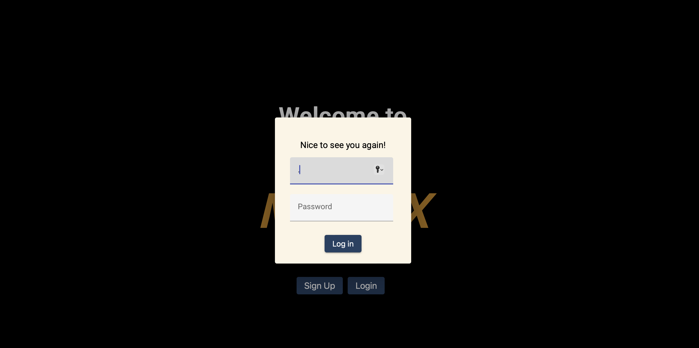

# MYFLIX-Angular-App

This project was generated with [Angular CLI](https://github.com/angular/angular-cli) version 16.2.6.

## Objective

Build a client-side application using Angular , which is based on the existing server-side code (RestAPI: Movi_API and the database in Atlas: MongoDB).

## Technologies Used

- Angular
- TypeScrip
- Angular Material
- MongoDB: NoSQL database (Atlas)
- Express
- Node.js and npm package
- Typedoc

## Design Criteria

- The user will be able to access information about movies such as description, director, genre among others.
- The user will be able to create a profile where they can add their favorite movies to a list and save them.

### Key Features

- The application displays a welcome view where users can log in or register an account.
- Once authenticated, the user can view all movies.
- Users can view additional information about a movie:

* a Button that when clicked displays the movie synopsis 2.
* A button that displays the director's biography when clicked.
* A button that, when clicked, displays the genre description of the movie.

4. The user can add/remove movies to his favorites list.

- Users can update their user information or delete their account.

### Screenshots

<table>
    <tr>
            
    </tr>
    <tr>
            
    </tr>
    <tr>
            
        </tr>
        <tr>
            
        </tr>
</table>

### Running the app

1. `git clone https://github.com/acarecor/MYFLIX-App `
2. `cd [PROJECT_FOLDER_NAME]`
3. `npm install @angular/cli`
4. `ng serve`
5. `Go to browser localhost:4200 `
